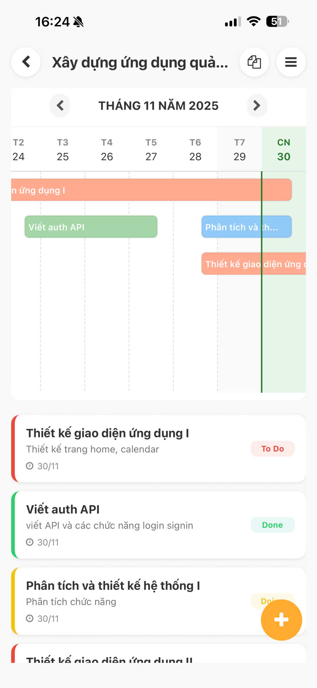
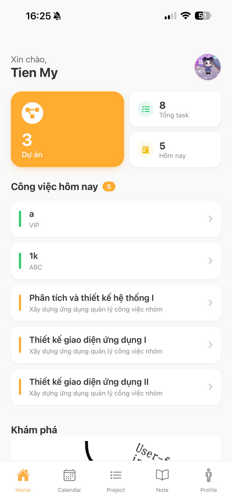
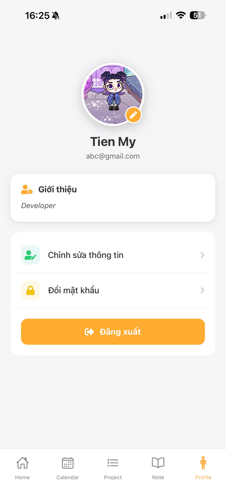
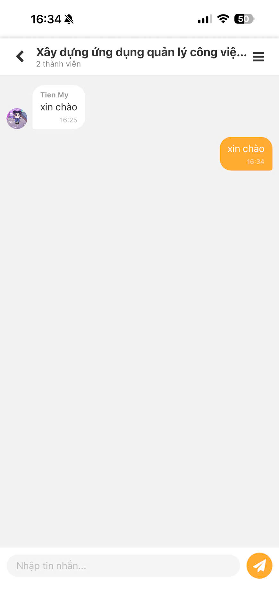
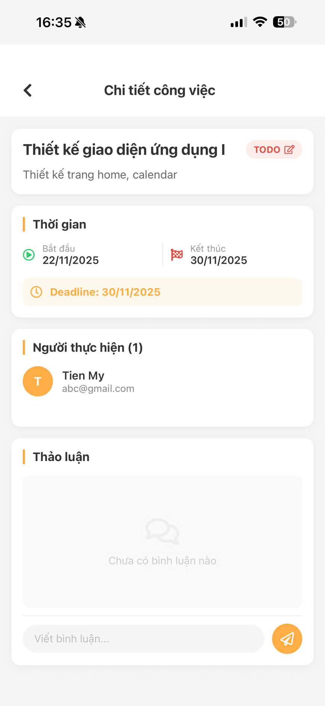
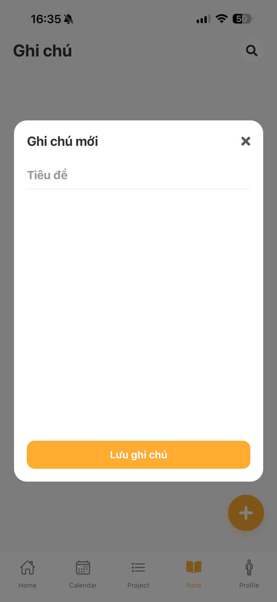

# 📱 HiveHub: Group Task Management Mobile Application

HiveHub is a mobile application designed for effective group task management. It enables task delegation, progress tracking, and real-time communication. The project is built using modern technologies including **Spring Boot**, **React Native **, **MySQL**, and a **Socket Server**.

---

## 🚀 Features

- ✅ **Task Management**: Create, update, delete, and assign tasks to team members
- 💬 **Real-Time Chat**: Communicate instantly within the team
- 🕓 **Task History**: Track changes and history of tasks

---

## 🛠️ Tech Stack

| Component | Technology Used           |
| --------- | ------------------------- |
| Frontend  | React Native (Expo)       |
| Backend   | Spring Boot (Java)        |
| Database  | MySQL                     |
| Real-time | Socket Server (WebSocket) |

---

## 📦 Installation

### 🔙 Backend

1. **Clone the repository**:

```bash
git clone https://github.com/tienmynguyen/HiveHub.git
```

2. **Configure the database** (in `backend/src/main/resources/application.properties`):

```properties
spring.datasource.url=jdbc:mysql://localhost:3306/your-database-name
spring.datasource.username=your-username
spring.datasource.password=your-password
spring.jpa.hibernate.ddl-auto=update
```

3. **Build and run the backend**:

```bash
cd BE
cd workshedule
./mvnw spring-boot:run
```

---

### 📱 Frontend

1. **Install dependencies and start Expo**:

```bash
cd ../FE
npm install
npx react-native start
```

<p align="left">
  
   
    
   </br>
    
   
    
   </p>

## 📬 Contact

- 📧 Email: mytom2401@gmail.com
